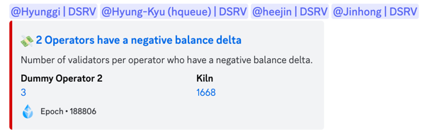

Converts Prometheus Alertmanager webhook to Discord or Slack webhooks.

## Usage

Default port to listen on is 5001 and can be configured by environment variable `PORT`.

Store configuration at `/etc/alertmanager-discord.yml` file e.g.:

```yaml
hooks:
  - slug: collaterals-monitoring
    type: discord
    hook: https://discord.com/api/webhooks/123
  - slug: balval-alerts
    type: discord
    hook: https://discord.com/api/webhooks/456
  - slug: automation-eng
    type: slack
    hook: https://hooks.slack.com/services/T000/B000/XXX
```

If `type` is omitted, `discord` is used by default.

Slack hooks should use `type: slack` with a Slack incoming webhook URL:

```yaml
hooks:
  - slug: evm-slack
    type: slack
    hook: https://hooks.slack.com/services/T000/B000/XXX
```

Configure alertmanager to send alerts to the related hook:

```yaml
receivers:
  - name: "collaterals-monitoring"
    webhook_configs:
      - url: "http://alertmanager-discord:5001/hook/collaterals-monitoring"
        send_resolved: false

  - name: "balval-alerts"
    webhook_configs:
      - url: "http://alertmanager-discord:5001/hook/balval-alerts"
```

## Additional features

#### Discord users mentions

Provide `mentions` alert's label value to mention arbitrary Discord user:

```yaml
mentions: <user_id_0>,<user_id_1>
```

User ID may be found on Discord by **Copy ID** context menu item available with
developer mode is turned on.

#### Slack users mentions

Provide `slack_mentions` alert's label value to mention arbitrary Slack users:

```yaml
slack_mentions: U123,U456,@here
```

#### Slack tables limit

Slack tables are chunked by `MAX_TABLE_ROWS` (default 50, max 70). Values above 70 are clamped to
avoid Slack payload failures:

```yaml
environment:
  MAX_TABLE_ROWS: 50
```

#### Title and description templating

Provide `TITLE_TMPL` and `DESCR_TMPL` to override title and/or description, e.g. in docker-compose:

```yaml
environment:
  TITLE_TMPL: >
    {{@if(it.status==='resolved'}}
    {{it.annotations.onResolved|d('')}}
    {{/if}}
```

If template is evaluating to an empty string, `annotations.summary` and `annotations.description` fields
will be used for title and description respectivelly.

Look at [squirrelly](https://squirrelly.js.org) docs for templating reference.

#### Inline fields

Provide `inline_fields` alert's annotation to insert inline fields in Discord or a Slack rich_text bullet list
using values from a markdown list:

```yaml
inline_fields: |
  - hello
  - there
```

## Alternative working mode

If you want to use this service in alternative working mode, you can provide `WORKING_MODE` environment variable.
For docker-compose it may look like this:

```yaml
environment:
  WORKING_MODE: "alternative"
```

It will allow you to describe alerts in the following way:

```yaml
- alert: NumValidatorsWithNegativeDelta
  expr: ethereum_validators_monitoring_validator_count_with_negative_balances_delta > 0 AND ON() changes(ethereum_validators_monitoring_epoch_number[1m]) > 0
  labels:
    severity: critical
  annotations:
    emoji: 💸
    summary: "Operators have a negative balance delta"
    resolved_summary: "Operators have a positive balance delta"
    description: "Number of validators per operator who have a negative balance delta."
    resolved_description: "Number of validators per operator who recovered."
    field_name: "{{ $labels.nos_name }}"
    field_value: '[{{ $value | printf "%.0f" }}](http://127.0.0.1:8082/d/3wimU2H7h/nodeoperators/?var-nos_name_var={{ urlquery $labels.nos_name }}&from={{ with query "(time() - 1200) * 1000" }}{{ . | first | value | printf "%f" }}{{ end }}&to={{ with query "time() * 1000" }}{{ . | first | value | printf "%f" }}{{ end }})'
    url: "http://127.0.0.1:8082/d/HRgPmpNnz/validators"
    footer_text: 'Epoch • {{ with query "ethereum_validators_monitoring_epoch_number" }}{{ . | first | value | printf "%.0f" }}{{ end }}'
    footer_icon_url: "https://cryptologos.cc/logos/steth-steth-logo.png"
```

And it will produce the following result:


## Alerts batching

It is possible to configure the number of records in one message of the Discord alert body, and the number of messages
in the Discord alert. This is possible using the following environment variables:

```yaml
environment:
  MAX_EMBEDS_LENGTH: 10
  MAX_FIELDS_LENGTH: 25
```

The default values for these environment variables are 10 and 25 respectively.

## Release flow

To create new release:

1. Merge all changes to the `master` branch
1. Navigate to Repo => Actions
1. Run action "Prepare release" action against `master` branch
1. When action execution is finished, navigate to Repo => Pull requests
1. Find pull request named "chore(release): X.X.X" review and merge it with "Rebase and merge" (or "Squash and merge")
1. After merge release action will be triggered automatically
1. Navigate to Repo => Actions and see last actions logs for further details
